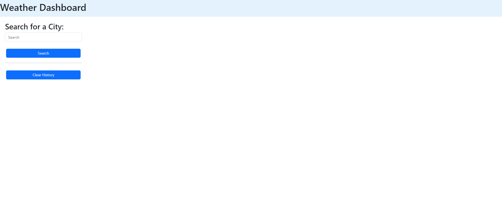
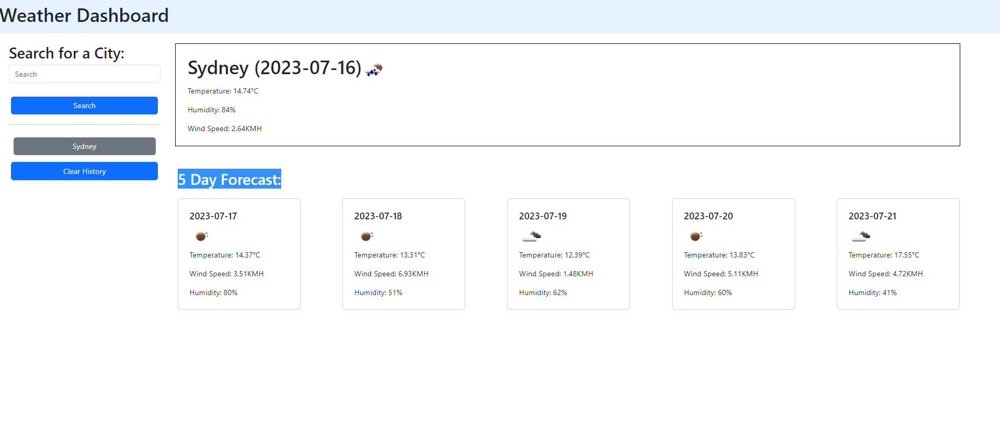

# weather-forecast-app

## Project Description

This application is a weather forecast application, where the user can input a city into the search bar and the application will display the current weather and a 5 day weather forecast. The weather forecast information is fetched from the openweather api, with the application being created from HTML, CSS and JavaScript. Bootstrap CSS framework has been used to improve the application's responsiveness. Jquery has also been used.

The challenges faced were utilising Jqeury incorrectly to dynamically create cards. Instead of displaying cards for each forecast day on the webpage it was displaying as [object] [object] on the webpage. A future feature which I hope to implement in the future is creating a seperate page which will display the weather forecast of each hour for a specific day.

## How to use

To use the application you can either go onto the repo link:
https://github.com/Andysu7117/weather-forecast-app where you can clone it and open it from your local environment.
or the gitpages link:
https://andysu7117.github.io/weather-forecast-app/

When you open the webpage you will be brought to this landing page:

When a city is searched for the page will display as:

## Credits

Getting current date was referenced from:
https://www.scaler.com/topics/get-current-date-in-javascript/
